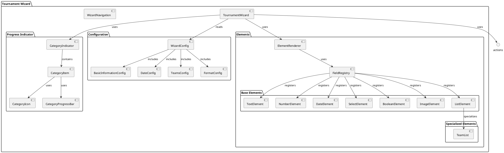

# Tournament Initialization Documentation

## Overview

The tournament initialization process provides a guided, step-by-step wizard interface for creating new tournaments. It handles the collection and validation of all necessary tournament configuration data through a series of questions organized by categories.

## Architecture

The tournament initialization system follows a modular architecture with clear separation between configuration, rendering components, and business logic.
Central to the system is the TournamentWizard component, which manages the wizard's state and logic. The following diagram shows the main components and their relationships.

## Components

### TournamentWizard
The main component orchestrating the wizard flow. It manages:
- Form state and validation
- Navigation between steps
- Category tracking and completion
- Progress indication

### Progress Indicator
A composite component showing the wizard's progress through categories:
- CategoryIndicator: Main container managing category state
- CategoryItem: Individual category display with completion status
- CategoryIcon: Category-specific icons and completion check
- CategoryProgressBar: Visual progress within current category

### Element Renderer
Renders the appropriate input component based on the field type. Works with the FieldRegistry to map field types to their corresponding components.

#### Available Elements
The wizard supports several types of input elements:

1. **Base Elements**
   - Text: Single-line text input
   - Number: Numeric input with validation
   - Date: Date picker with calendar
   - Select: Dropdown selection from options
   - Boolean: Yes/No toggle or checkbox
   - Image: Image upload with preview
   - List: Dynamic list of items

2. **Specialized Elements**
   - TeamList: Custom component for managing team entries
     - Supports adding/removing teams
     - Validates team names
     - Manages team order

### Wizard Actions
Handles navigation buttons and their states:
- Back/Cancel button
- Next/Skip/Finish button
- Validates current step before proceeding

## Categories and Questions

The wizard organizes questions into the following categories:

1. **Basic Information**
   - Tournament name (Text)
   - Logo upload (Image)
   - Tournament format (Select)

2. **Tournament Dates**
   - Start date (Date)
   - Multiple days option (Boolean)
   - End date (Date, conditional)

3. **Teams**
   - Number of teams (Number)
   - Team list management (List with TeamList)

4. **Tournament Mode**
   - League configuration
     - Matches against each team (Number)
     - Match duration (Number)
   - Group stage configuration
     - Number of groups (Number)
     - Teams qualifying (Number)
   - Knockout configuration
     - Match format (Select)
     - Third place match (Boolean)

5. **Rules**
   - Match duration (Number)
   - Points system
     - Win points (Number)
     - Draw points (Number)
   - Tiebreaker rules (List)