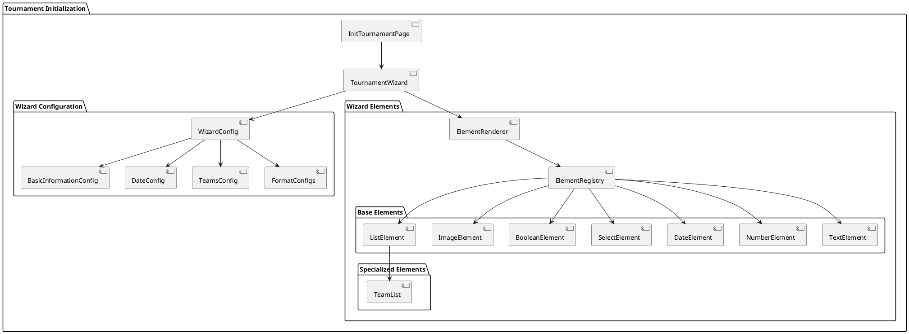

# Tournament Initialization Documentation

## Overview

The tournament initialization process provides a guided, step-by-step wizard interface for creating new tournaments. It handles the collection and validation of all necessary tournament configuration data through a series of questions.

## Architecture

The tournament initialization system follows a modular architecture with clear separation between configuration, rendering components, and business logic.
Central to the system is the TournamentWizard component, which manages the wizard's state and logic. The following diagram shows the main components and their relationships.

## Core Components

### Configuration Layer
- **WizardConfig**: Aggregates all configuration elements
- **Topic Configs**: Separate configurations for different aspects:
  - BasicInformationConfig
  - DateConfig
  - TeamsConfig
  - FormatConfigs (League, Group, Knockout)

### Rendering Layer
- **ElementRenderer**: Main component for rendering wizard elements
- **ElementRegistry**: Maps element types to their components
- **Specialized Elements**: Custom components for specific needs

### Element Types
- Text
- Number
- Date
- Select
- Boolean
- Image
- List (with custom components)

Hint: The element type 'list' is a special case that requires a custom component to be implemented. All the other elements are implemented using default components (e.g. a text input, a number input, etc.).

## Configuration Structure

The wizard configuration is organized by topics:

1. **Basic Information**
   - Tournament name
   - Logo
   - Format selection

2. **Dates**
   - Start date
   - Multiple days option
   - End date (conditional)

3. **Teams**
   - Number of teams
   - Team list management

4. **Format-Specific**
   - League configuration
   - Group stage configuration
   - Knockout configuration